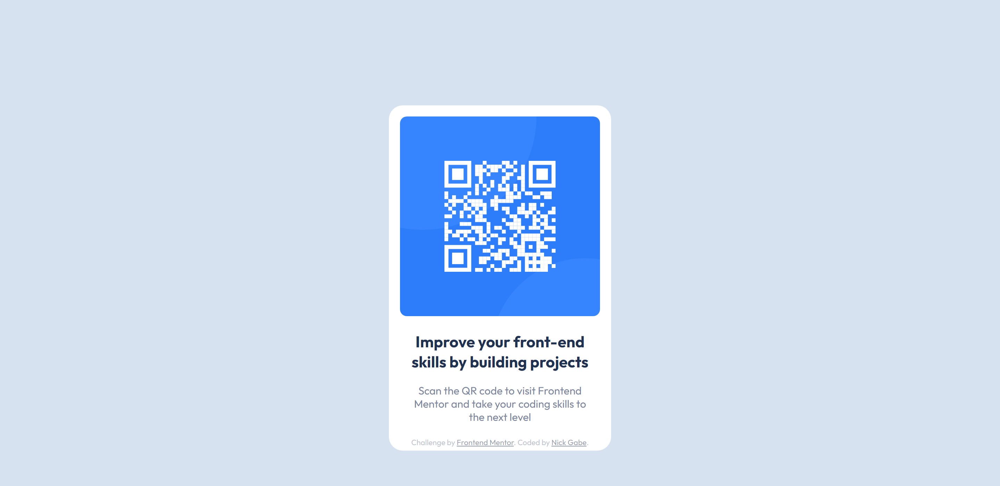

# Frontend Mentor - QR code component solution

This is a solution to the [QR code component challenge on Frontend Mentor](https://www.frontendmentor.io/challenges/qr-code-component-iux_sIO_H). Frontend Mentor challenges help you improve your coding skills by building realistic projects. 

## Table of contents

- [Overview](#overview)
  - [Screenshot](#screenshot)
  - [Links](#links)
- [My process](#my-process)
  - [Built with](#built-with)
  - [Continued development](#continued-development)
- [Author](#author)

## Overview

### Screenshot

### Links

- Solution URL: [Click here](https://www.frontendmentor.io/challenges/qr-code-component-iux_sIO_H/hub/simple-qr-component-YaMC3vz12)
- Live Site URL: [Click here](https://nick-gabe.github.io/frontend-qr-component/)

### Built with

- Semantic HTML5 markup
- CSS custom properties
- Flexbox
- Animations
- Desktop-first workflow

### Continued development

I will keep learning Css and improve my skills at it, and for now im still doing easy challenges, but I look forward to mastering Css, Html and Js in the future.

## Author

- Frontend Mentor - [@Nick-Gabe](https://www.frontendmentor.io/profile/Nick-Gabe)
- GitHub - [@Nick-Gabe](https://github.com/Nick-Gabe/)
- Twitter - [@MyNickIsNick_](https://www.twitter.com/MyNickIsNick_)